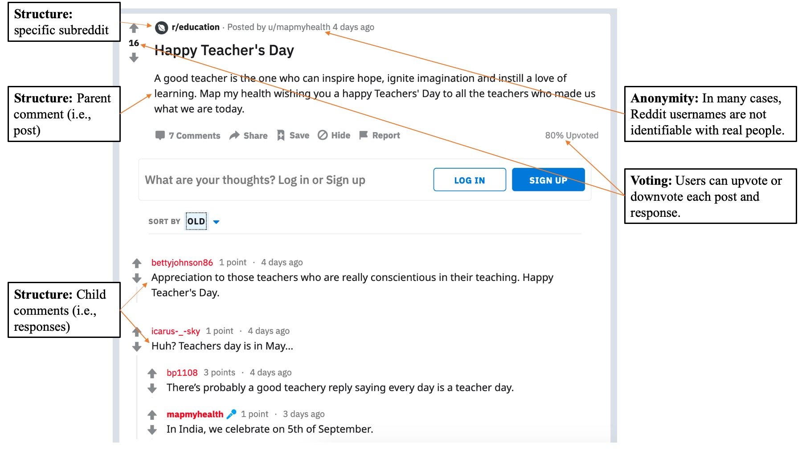
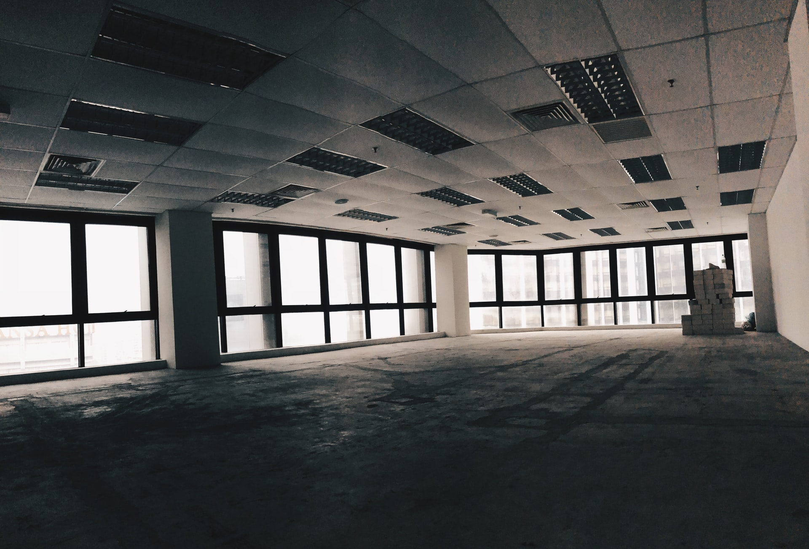
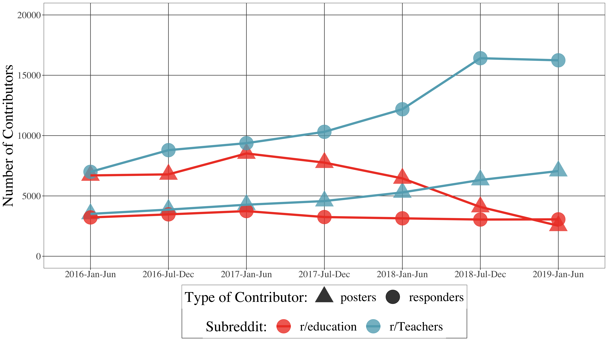
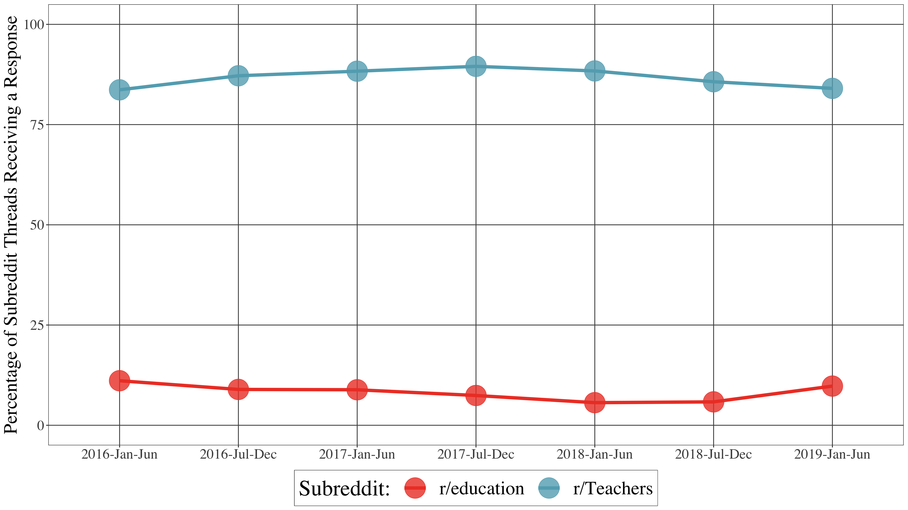

```{r setup, include=FALSE}
usethis::use_git_ignore(c("*.csv", "*.rds"))
options(htmltools.dir.version = FALSE)

#titleSlideClass: [inverse, center, middle]
#"default", "metropolis", "metropolis-fonts", 

# see options for customize slides: 
# https://slides.yihui.name/xaringan/
# https://slides.yihui.name/xaringan/incremental.html
# https://github.com/yihui/xaringan/wiki

library(knitr)
library(tidyverse)
library(xaringan)
```

class: inverse, center, middle

**View Slides:** [bretsw.github.io/aect20-featured](https://bretsw.github.io/aect20-featured)

**Twitter:** [@bretsw](https://twitter.com/bretsw) | [@jeffpcarpenter](https://twitter.com/jeffpcarpenter)

---

class: inverse, center, middle

# Social Media in Education

---

# Self-directed Learning

```{r, out.width = "720px", echo = FALSE, fig.align = "center"}
include_graphics("img/teacher.jpg")
```

---

# The Times They Are A-changin'

```{r, out.width = "720px", echo = FALSE, fig.align = "center"}
include_graphics("img/across-time-full.jpg")
```

---

# Rise and Fall of Myspace

```{r, out.width = "600px", echo = FALSE, fig.align = "center"}
include_graphics("img/myspace.png")
```

[*Image source: Business Insider (2011)*](https://www.businessinsider.com/chart-of-the-day-the-fall-of-myspace-2011-6)

---

# Purpose

### Reddit, over time

To compare and contrast *continuity and change* in how users contribute, interact, and converse in two subreddits

```{r, out.width = "600px", echo = FALSE, fig.align = "center"}
include_graphics("img/across-time-full.jpg")
```

---

class: inverse, center, middle

# Background

---

# Reddit Background

```{r, out.width = "240px", echo = FALSE, fig.align = "center"}
include_graphics("img/reddit-logo.png")
```

--

1. \#7 website in the United States; \#18 in the world

--

1. Collection of discussion forums (i.e., **subreddits**)

--

1. Threaded discussions: **posts** and **responses**

--

1. Voting: **+1** or **-1**

--

1. Anonymity

---

# Reddit Features

```{r, out.width = "840px", echo = FALSE, fig.align = "center"}

```

---

# Teaching-related Subreddits

```{r, out.width = "240px", echo = FALSE, fig.align = "center"}
include_graphics("img/reddit-logo.png")
```

--

- Education in general (e.g., r/education)

--

- Education level (e.g., r/highereducation)

--

- Subject area (e.g., r/historyteachers, r/matheducation, r/MusicEd)

---

# Comparing Two Subreddits

[**reddit.com/r/Teachers**](https://www.reddit.com/r/Teachers/) | [**reddit.com/r/education**](https://www.reddit.com/r/education/)

```{r, out.width = "480px", echo = FALSE, fig.align = "center"}
include_graphics("img/teacher.jpg")
```

--

- Both  part of the Reddit Education Network  (16 subreddits)

--

- Highest subscription of teaching-related subreddits
  - **r/Teachers:** 192,000 subscribers
  - **r/education:** 119,000 subscribers

---

class: inverse, center, middle

# Framework

---

# Framework

### Learning ecologies

```{r, out.width = "480x", echo = FALSE, fig.align = "center"}
include_graphics("img/network.jpg")
```

--

- Complementary components

--

- Transitions (i.e., change over time)

---

# Framework

### Affinity spaces

```{r, out.width = "480px", echo = FALSE, fig.align = "center"}

```

--

- Individual contributions

--

- Content interactions

--

- Social interactions

---

class: inverse, center, middle

# Research Questions

---

# Research Questions

```{r, out.width = "360", echo = FALSE, fig.align = "center"}
include_graphics("img/question.jpg")
```

### How have the r/Teachers and r/education subreddits changed, or remained the same, over time? 

--

1. Individual contributions

--

1. Content interactions

--

1. Social interactions

--

1. Topics of conversation

--

1. Types of discourse

---

class: inverse, center, middle

# Method

---

# Data Collection

```{r, out.width = "240px", echo = FALSE, fig.align = "center"}
include_graphics("img/reddit-logo.png")
```

--

- **3.5 years** (42 months): from January 1, 2016 to June 30, 2019

--

- **r/Teachers:** 696,660 contributions from 55,148 contributors
  - 54,933 posts and 641,727 responses 

--

- **r/education:** 339,618 contributions from 43,711 contributors
  - 252,340 posts and 87,278 responses 

---

# Data Analysis

```{r, out.width = "240px", echo = FALSE, fig.align = "center"}
include_graphics("img/reddit-logo.png")
```

--

- Split data into 7 six-month partitions

--

- **Quantitative analysis** of individual contributions, content interactions, and social interactions

--

- **Qualitative analysis** of topics of conversation and types of discourse in top-ten posts (defined by highest voting scores) in each subreddit, and up to the top-ten responses to each of these

--

- 2 subreddits x 7 time periods x 10 posts =  **140 posts**

- 2 subreddits x 7 time periods x 100 responses = **1,460 responses**

---


class: inverse, center, middle

# Results

---

# Daily Contributions

```{r, out.width = "840px", echo = FALSE, fig.align = "center"}
include_graphics("img/fig1-contributions-over-time.png")
```

---

# Contributors

```{r, out.width = "840px", echo = FALSE, fig.align = "center"}

```

---

# Response Rate

```{r, out.width = "840px", echo = FALSE, fig.align = "center"}

```

---

# Thread Length

```{r, out.width = "840px", echo = FALSE, fig.align = "center"}
include_graphics("img/fig4-thread-length.png")
```

---

# Node Degree

```{r, out.width = "840px", echo = FALSE, fig.align = "center"}
include_graphics("img/fig5-mean-node-degree.png")
```

---

# Transitivity

```{r, out.width = "840px", echo = FALSE, fig.align = "center"}
include_graphics("img/fig6-transitivity.png")
```

---

# Reciprocity

```{r, out.width = "840px", echo = FALSE, fig.align = "center"}
include_graphics("img/fig7-reciprocity.png")
```

---

# Network Visualizations

```{r, out.width = "480px", echo = FALSE, fig.align = "center"}
include_graphics("img/fig8-network-visualization.png")
```

---

# Posts - Content Analysis

```{r, out.width = "480px", echo = FALSE, fig.align = "center"}
include_graphics("img/fig9-post-plot-bar1.png")
```

---

# Posts - Content Analysis

```{r, out.width = "480px", echo = FALSE, fig.align = "center"}
include_graphics("img/fig9-post-plot-bar2.png")
```

---

# Responses - Content Analysis

```{r, out.width = "480px", echo = FALSE, fig.align = "center"}
include_graphics("img/fig10-response-plot-bar.png")
```

---

class: inverse, center, middle

# Discussion

---

# Change and Continuity

```{r, out.width = "360px", echo = FALSE, fig.align = "center"}

```

--

- **r/Teachers:** 

--

  - Individual contributions increased steadily, clustering decreased, mutuality increased, topics consistently included teachers’ lived experiences and pedagogy
  
--

- **r/education:** 

--

  - Posts and posters declined, thread length increased, clustering decreased, mutuality increased, topics consistently included education policy and societal factors
  
---

# Distinct Purposes

```{r, out.width = "480px", echo = FALSE, fig.align = "center"}
include_graphics("img/social-media.jpg")
```

--

- **r/Teachers:** a conversational space

--

  - many responses, long threads, educators' lived experiences

--

- **r/education:** a bulletin board space

--

  - many posts, few responses, more content-focused

---

# Significance

```{r, out.width = "360px", echo = FALSE, fig.align = "center"}
include_graphics("img/scatter.jpg")
```

- Educators' self-directed learning is tied to context and has a temporal dimension

--

- Need to advise aspiring educators how best to combine different spaces for maximum effect

--

- There is value to anonymous spaces for educators

--

  - Example: Place to vent and unburden emotions from COVID-19 disruptions and frustrations

---

# Conclusion

```{r, out.width = "480px", echo = FALSE, fig.align = "center"}
include_graphics("img/across-time-full.jpg")
```

--

- Self-directed learning on Reddit is different than visiting a library

--

- Educators must work to become critical consumers of ideas and materials encountered in online spaces 

--

- Educators, instructional designers, and scholars must continue to reflect upon and analyze both opportunities and challenges of self-directed learning in the complex ecologies of social media spaces

---

# Questions?

```{r, out.width = "360px", echo = FALSE, fig.align = "center"}
include_graphics("img/question.jpg")
```

- **Email:** [staudtwi@msu.edu](mailto:staudtwi@msu.edu) | [jcarpenter13@elon.edu](jcarpenter13@elon.edu)

- **Twitter:** [@bretsw](https://twitter.com/bretsw) | [@jeffpcarpenter](https://twitter.com/jeffpcarpenter)

- **Slides:** [bretsw.github.io/aect20-featured)](https://bretsw.github.io/aect20-featured)

- **R code:** [github.com/bretsw/subreddits-over-time](https://github.com/bretsw/subreddits-over-time)

- **Data:** [osf.io/tm74g](https://osf.io/tm74g/)

- **Article in BJET:** [doi:10.1111/bjet.13051](https://doi.org/10.1111/bjet.13051)  *(Available soon)*